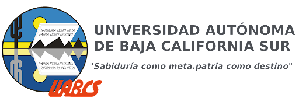

# Universidad Autonoma de Baja California Sur

# Ingenieria en Desarrollo de Software 9no Semestre
# Perceptrón sencillo para separar dos conjuntos de puntos.

Instrucciones: Construir en su lenguaje de preferencia, un perceptrón que aprenda a separar dos conjuntos de puntos en el plano, como se vio en clase.

    - Adan Enrique Ramirez Cisneros
    - 29 de Octubre del 2021

## Como Funciona
    - objects/ball.js
    - objects/neuro.js
    - sketch.js